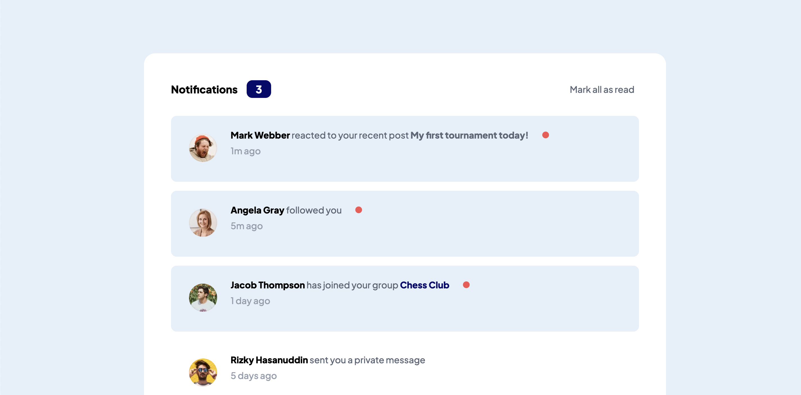
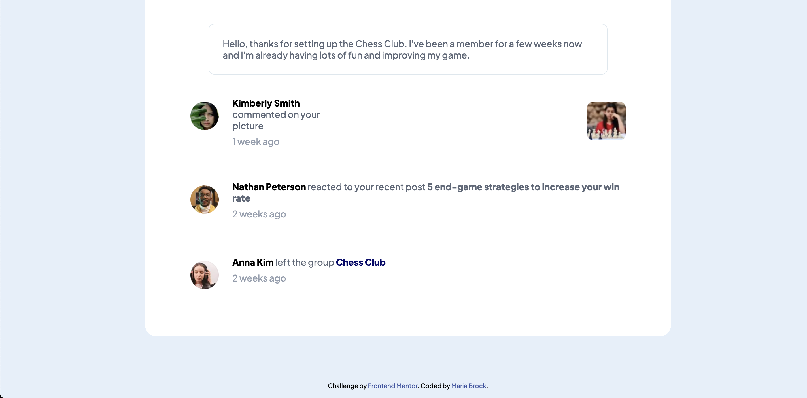
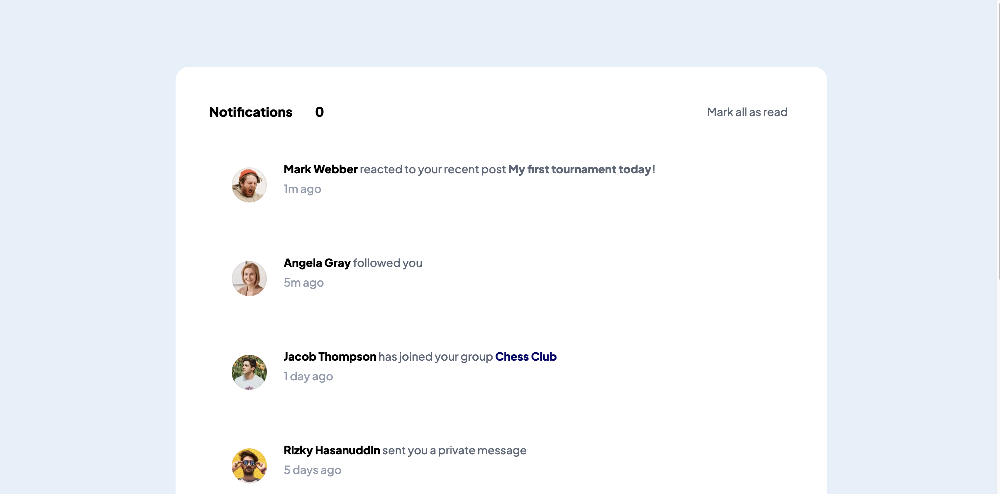
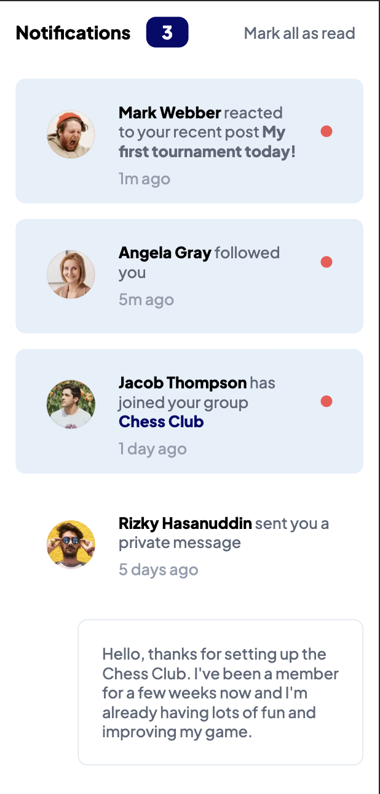
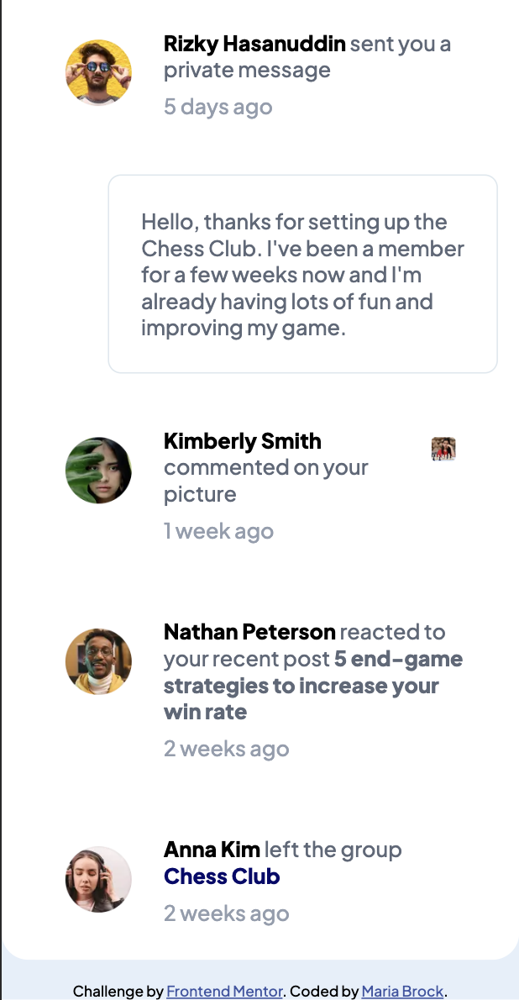
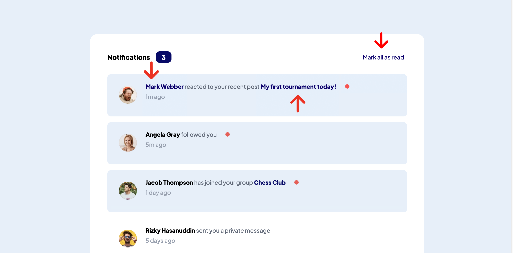

# Frontend Mentor - Notifications page solution

This is a solution to the [Notifications page challenge on Frontend Mentor](https://www.frontendmentor.io/challenges/notifications-page-DqK5QAmKbC). Frontend Mentor challenges help you improve your coding skills by building realistic projects. 

## Table of contents

- [Dev Server](#development-server)
- [Overview](#overview)
  - [The challenge](#the-challenge)
  - [Screenshot](#screenshot)
  - [Links](#links)
- [My process](#my-process)
  - [Built with](#built-with)
  - [What I learned](#what-i-learned)
  - [Useful resources](#useful-resources)
- [Author](#author)

This project was generated with [Angular CLI](https://github.com/angular/angular-cli) version 17.0.5.

## Development server

Run `ng serve` for a dev server. Navigate to `http://localhost:4200/`. The application will automatically reload if you change any of the source files.

## Overview

### The challenge

Users should be able to:

- Distinguish between "unread" and "read" notifications
- Select "Mark all as read" to toggle the visual state of the unread notifications and set the number of unread messages to zero
- View the optimal layout for the interface depending on their device's screen size
- See hover and focus states for all interactive elements on the page

### Screenshot








### Links

- Solution URL: [Github](https://github.com/mariabrock/frontendmentorio-notifications-page-angular)
- Live Site URL: [Github Pages](https://your-live-site-url.com)

## My process

### Built with

- Semantic HTML5 markup
- CSS custom properties
- Flexbox
- Mobile-first workflow
- [Angular](https://angular.io/) - JS Framework

### What I learned

```html
<div class="notif" [ngClass]="notifBackground">
  <div class="image">
    
  </div>
  <div>
    <div class="with-circle">
      <p><span class="name" routerLink="#">Mark Webber</span> reacted to your recent post <span class="event post" routerLink="#">My first tournament today!</span></p><span [ngClass]="iconDisplay"><i class="fa-solid fa-circle fa-xs"></i></span>
    </div>
    <p class="footer">1m ago</p>
  </div>
</div>
```
```ts
_isRead = signal(false);

setBoolean() {
  this._isRead.set(true);
  console.log(this._isRead);
}
```

### Useful resources

- [Getting Started with Angular Signals](https://codelabs.developers.google.com/angular-signals#0) - Angular Signals Walkthrough Project by the Google team.
- [Angular & Signals: Everything You need to know.](https://dev.to/this-is-angular/angular-signals-everything-you-need-to-know-2b7g) - A deep dive on the need for Signals.

## Author

- Github - [@mariabrock](https://github.com/mariabrock)
- Frontend Mentor - [@mariabrock](https://www.frontendmentor.io/profile/mariabrock)
- LinkedIn - [@mariabrock](https://www.linkedin.com/in/maria-brock/)
